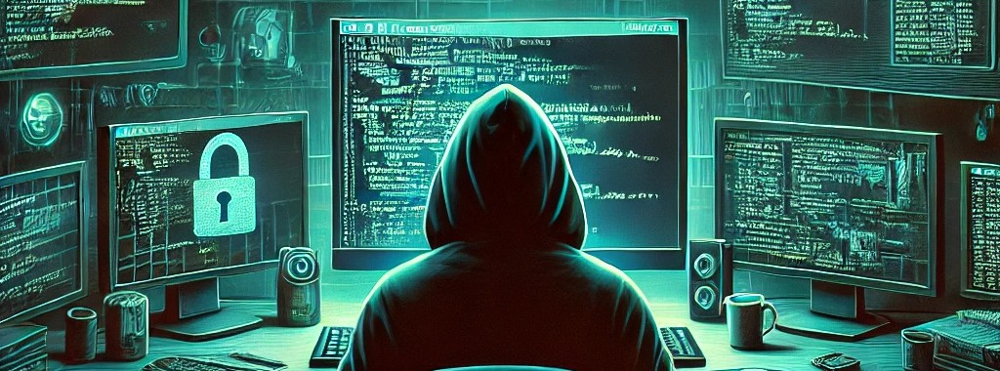

# Scripts 

This repository contains various scripts I have created during my learning journey in the field of cybersecurity. 🛡️

## Main Programming Languages 🖥️

### **Bash** 🐧
The Bash scripts included here are primarily related to [Wargames](https://github.com/Cristian5tarellas/Wargames) challenges. Most of them automate access to specific levels of OverTheWire Wargames.

**[Scripts](Bash/)**

### **Python** 🐍
The Python scripts focus on **enumeration techniques** and **attack simulations**, such as Man-in-the-Middle (MITM) attacks.

**[Scipts](Python/)**

## Disclaimer ⚠️
These scripts are intended for educational purposes only. They should only be used in controlled environments where you have explicit permission to perform security testing. I am not responsible for any misuse of the scripts provided in this repository.
